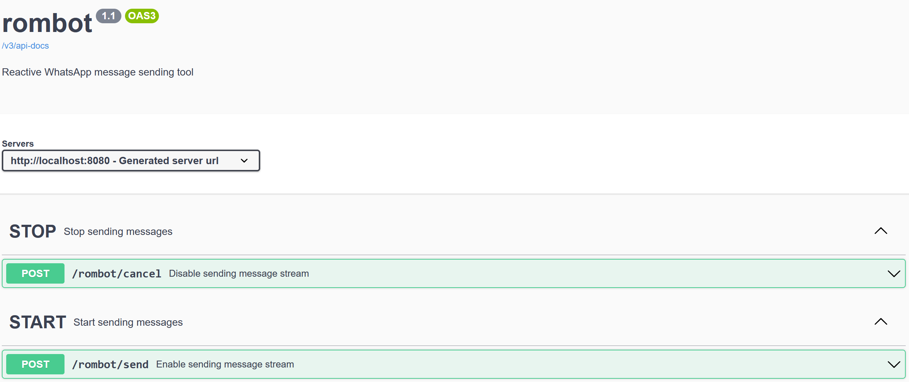

# java-rombot
Reactive WhatsApp message sending tool

### Description

rombot allows to send template messages via WhatsApp Business / Cloud API.

It can be easily configured to work with 3rd party API (UltraMsg API was used as a sample)

### Swagger UI

### Requirements
- WhatsApp Business Account
- Application in Meta for Developers
- ALTERNATIVELY - account on 3rd party API
- Template message created
- JDK / JVM installed
- MongoDB with contacts configured

### Before start

Add your credentials to application.properties.

### Tech stack
- Java 17
- Spring WebFlux + Project Reactor
- Reactive MongoDB
- WebClient